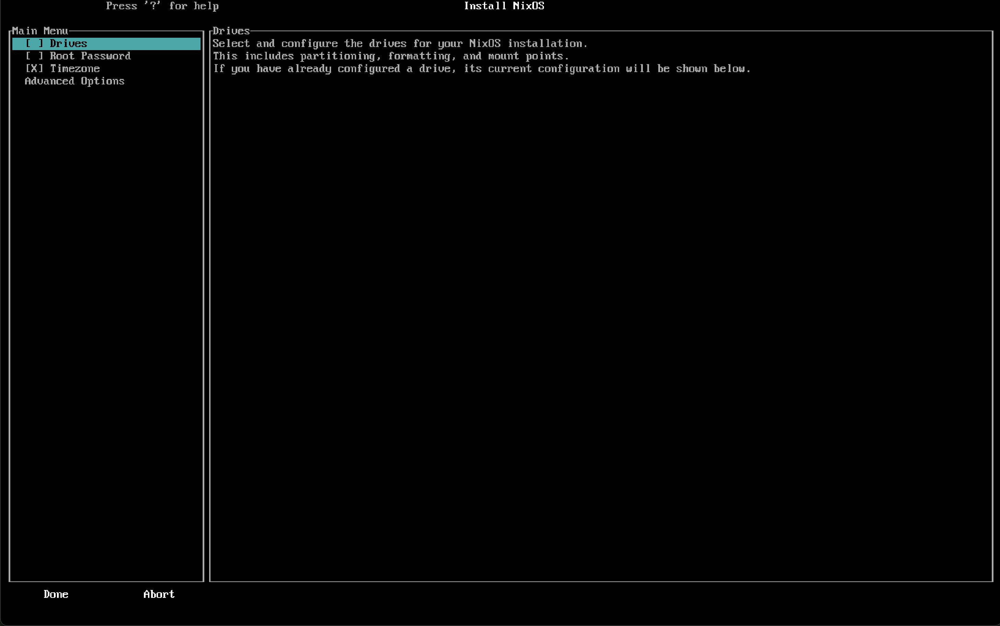

# homelabinator-backend

The API exists in the `api/` directory that contains the API that the `homelabinator_unified` frontend talks with to build an ISO file. This API must be ran on a NixOS host. The `nixos-wizard` directory contains the flakes that build an ISO for the 

## Acknoledgements

This project would not have been possible at all without the phenomenal tool that is [km-clay/nixos-wizard](https://github.com/km-clay/nixos-wizard). All credit to them!
